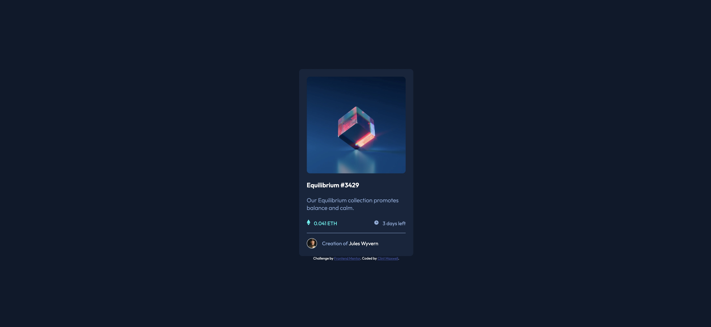
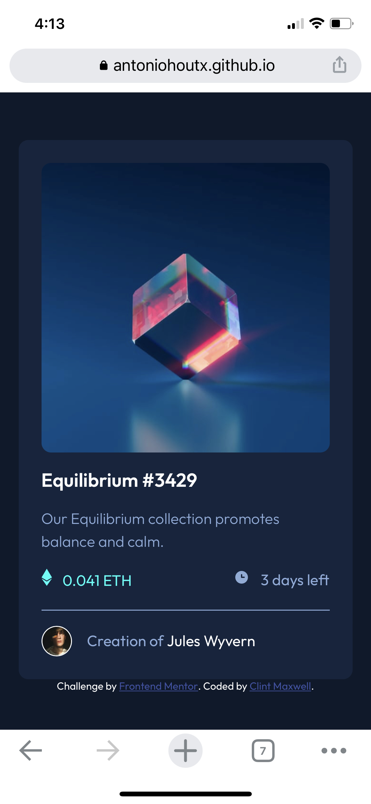
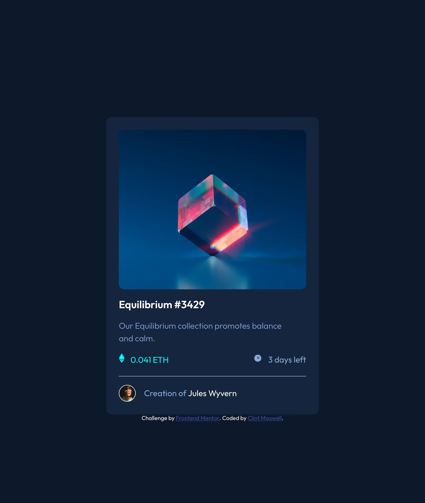

# Frontend Mentor - NFT preview card component solution

This is a solution to the [NFT preview card component challenge on Frontend Mentor](https://www.frontendmentor.io/challenges/nft-preview-card-component-SbdUL_w0U). Frontend Mentor challenges help you improve your coding skills by building realistic projects. 

## Table of contents

- [Overview](#overview)
  - [The challenge](#the-challenge)
  - [Screenshot](#screenshot)
  - [Links](#links)
- [My process](#my-process)
  - [Built with](#built-with)
  - [What I learned](#what-i-learned)
  - [Continued development](#continued-development)
  - [Useful resources](#useful-resources)
- [Author](#author)
- [Acknowledgments](#acknowledgments)


## Overview

### The challenge

Users should be able to:

- View the optimal layout depending on their device's screen size
- See hover states for interactive elements

### Screenshots
#### Desktop Version

#### Mobile Version


#### Tablet Version



### Links

- Solution URL: [Frontend Mentor | Responsive Web Page using Flexbox](https://www.frontendmentor.io/solutions/responsive-web-page-using-flexbox-OfqtAG6AE)
- Live Site URL: [Frontend Mentor | NFT preview card component](https://antoniohoutx.github.io/nft-preview-card-component-main/)

## My process

### Built with

- Semantic HTML5 markup
- CSS custom properties
- Flexbox
- Responsive design


### What I learned

One of the challenging aspects of this project was to get the mouseover overlay to work properly, so I used CSS styling to achieve the desired effect, as shown in the following code snippet:

To see how you can add code snippets, see below:


```css
.cube {
  background-image: url("./images/image-equilibrium.jpg");
  background-size: cover;
  background-position: center;
  display: block;
  height: 19rem;
  width: 100%;
  border-radius: 10px;
}

.cube:hover {
  cursor: pointer;
  background: url("./images/image-equilibrium.jpg") no-repeat center/cover,
    url("./images/icon-view.svg") no-repeat center hsl(178, 100%, 50%);
  background-blend-mode: overlay;
}
```


### Continued development

I would like to continue to focus on media queries, which can sometimes be tricky to get right, given the wide array of screen sizes and resolutions that exist.  


### Useful resources

- [MDN Web Docs](https://developer.mozilla.org/en-US/) - The go-to reference for web development, be it CSS, HTML, or JavaScript.

## Author


- LinkedIn - [Clint Maxwell](https://www.linkedin.com/in/maxwellclint/)
- Frontend Mentor - [@AntonioHouTX](https://www.frontendmentor.io/profile/AntonioHouTX)


## Acknowledgments

I would like to thank the wonderful people on the Frontend Mentor Slack community for their feedback while working on this project.

